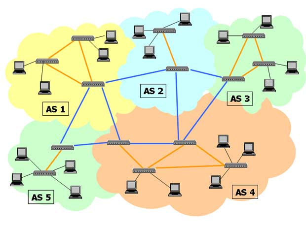
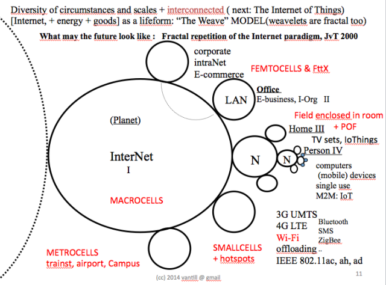
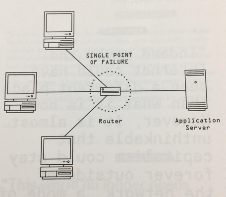

> I'm exploring how the internet infrastructure forms communities at its borders. 
<blockquote class="right">
To do this I am making computer networking devices which augment how subnetworks interact with external networks.
</blockquote>

---

---

---

The Network Router

Routers act as gateways to the internet. They form local networks and provide a link to outside networks.

---

How can the router affect our experience of the internet?

