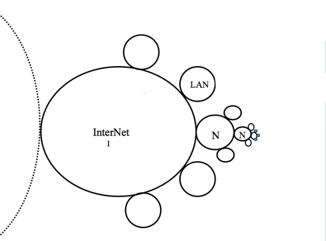

The Internet's Topology

---

The Internet is fractal  

---

> I'm exploring how the internet infrastructure forms communities at its borders. 
<blockquote class="right">
To do this I am making computer networking devices which augment how subnetworks interact with external networks.
</blockquote>

---

<h3>Networking Hardware</h3>

Internet > Modem > Firewall > Router > WiFi Access Point > Devices

---

<h2>Network Router</h2>
<ul>
<li>Routes traffic inside and outside of a network</li>
<li>Can be a firewall </li>
<li>Provides wireless access</li>
<li>DNS resolver</li>
<li>Software and hardware defined rules</li>
</ul>

---

How can the router affect our experience of the internet?

