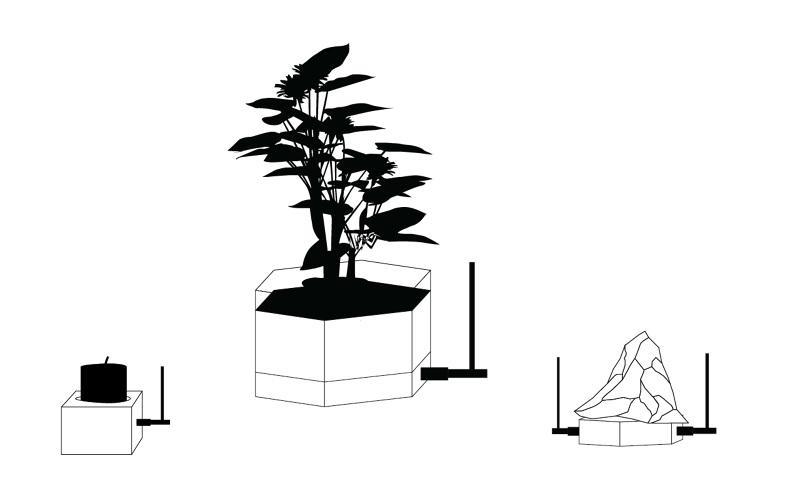
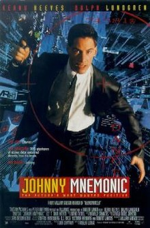

# Projects that inspired me

---

**Julian Oliver**  
_Packet Garden_, 2006

---

**Tega Brain**  
_Being Radiotropic_, 2016

---

Heath Bunting

---

net.art  

MTAA, <em>Simple Net Art Diagram</em>, ca. 1997. Animated GIF

---

Accessibility of technical information  
Protocols that define channels of communication  
Re-imagine networked technology  

---

# Research

---

---

The Critical Engineering Manifesto

<ul style="list-style-type: none;">
<li>0. The Critical Engineer considers Engineering to be the most transformative language of our time, shaping the way we move, communicate and think. It is the work of the Critical Engineer to study and exploit this language, exposing its influence.   </li>
<li>1. The Critical Engineer considers any technology depended upon to be both a challenge and a threat. The greater the dependence on a technology the greater the need to study and expose its inner workings, regardless of ownership or legal provision.   </li>
<li>2. The Critical Engineer raises awareness that with each technological advance our techno-political literacy is challenged.   </li>
<li>3. The Critical Engineer deconstructs and incites suspicion of rich user experiences.   </li>
<li>4. The Critical Engineer looks beyond the "awe of implementation" to determine methods of influence and their specific effects.   </li>
<li>5. The Critical Engineer recognises that each work of engineering engineers its user, proportional to that user's dependency upon it.   </li>
<li>6. The Critical Engineer expands "machine" to describe interrelationships encompassing devices, bodies, agents, forces and networks.   </li>
<li>7. The Critical Engineer observes the space between the production and consumption of technology. Acting rapidly to changes in this space, the Critical Engineer serves to expose moments of imbalance and deception.   </li>
<li>8. The Critical Engineer looks to the history of art, architecture, activism, philosophy and invention and finds exemplary works of Critical Engineering. Strategies, ideas and agendas from these disciplines will be adopted, re-purposed and deployed.   </li>
<li>9. The Critical Engineer notes that written code expands into social and psychological realms, regulating behaviour between people and the machines they interact with. By understanding this, the Critical Engineer seeks to reconstruct user-constraints and social action through means of digital excavation.   </li>
<li>10. The Critical Engineer considers the exploit to be the most desirable form of exposure.    </li>
<li>The Critical Engineering Working Group  </li>
<li>Julian Oliver  </li>
<li>Gordan Savičić  </li>
<li>Danja Vasiliev  </li>
<li>Berlin, October 2011-2014</li>
<li></li>
<li></li>
<li>Copyright Oliver, Savičić, Vasiliev 2011-2014, GNU Free Documentation License v1.3.</li>
</ul>

---

A feminist server…

<ul>
<li>Is a situated technology. She has a sense of context and considers herself to be part of an ecology of practices</li>
<li>Is run for and by a community that cares enough for her in order to make her exist</li>
<li>Builds on the materiality of software, hardware and the bodies gathered around it</li>
<li>Opens herself to expose processes, tools, sources, habits, patterns</li>
<li>Does not strive for seamlessness. Talk of transparency too often signals that something is being made invisible</li>
<li>Avoids efficiency, ease-of-use, scalability and immediacy because they can be traps</li>
<li>Knows that networking is actually an awkward, promiscuous and parasitic practice</li>
<li>Is autonomous in the sense that she decides for her own dependencies</li>
<li>Radically questions the conditions for serving and service; experiments with changing client-server relations where she can </li>
<li>Treats network technology as part of a social reality</li>
<li>Wants networks to be mutable and read-write accessible</li>
<li>Does not confuse safety with security</li>
<li>Takes the risk of exposing her insecurity</li>
<li>Tries hard not to apologize when she is sometimes not available</li>
</ul>

---

"[On the internet] there's no distinction between broadcaster and receiver" 
<cite>Aaron Schwartz</cite>

---

