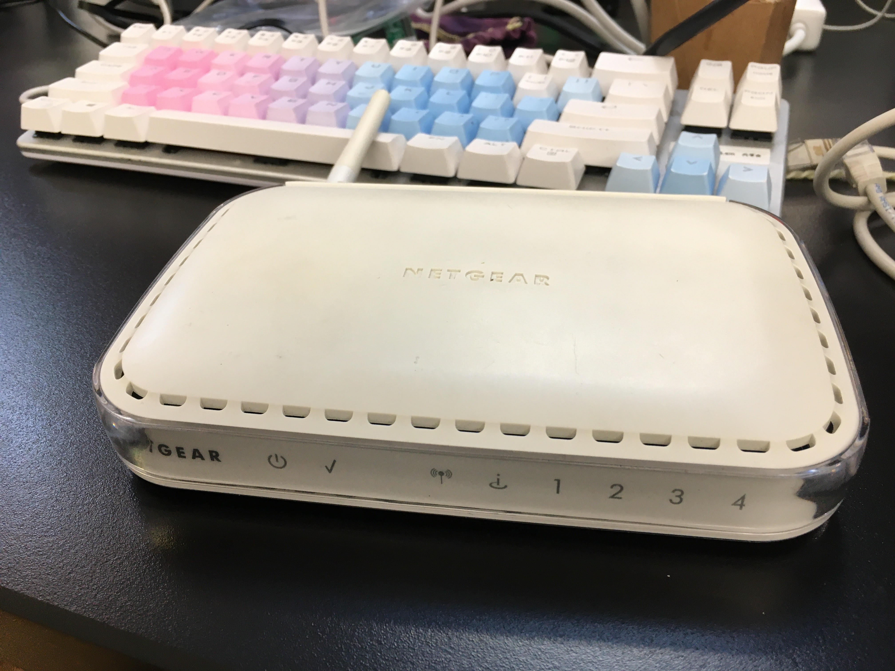
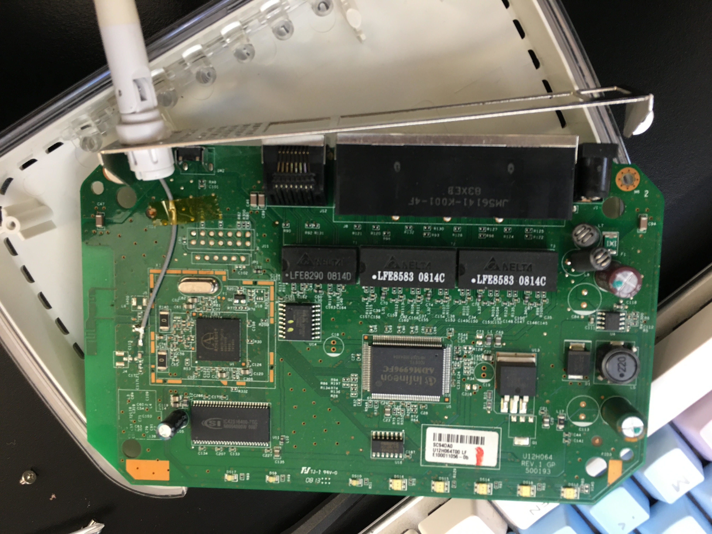
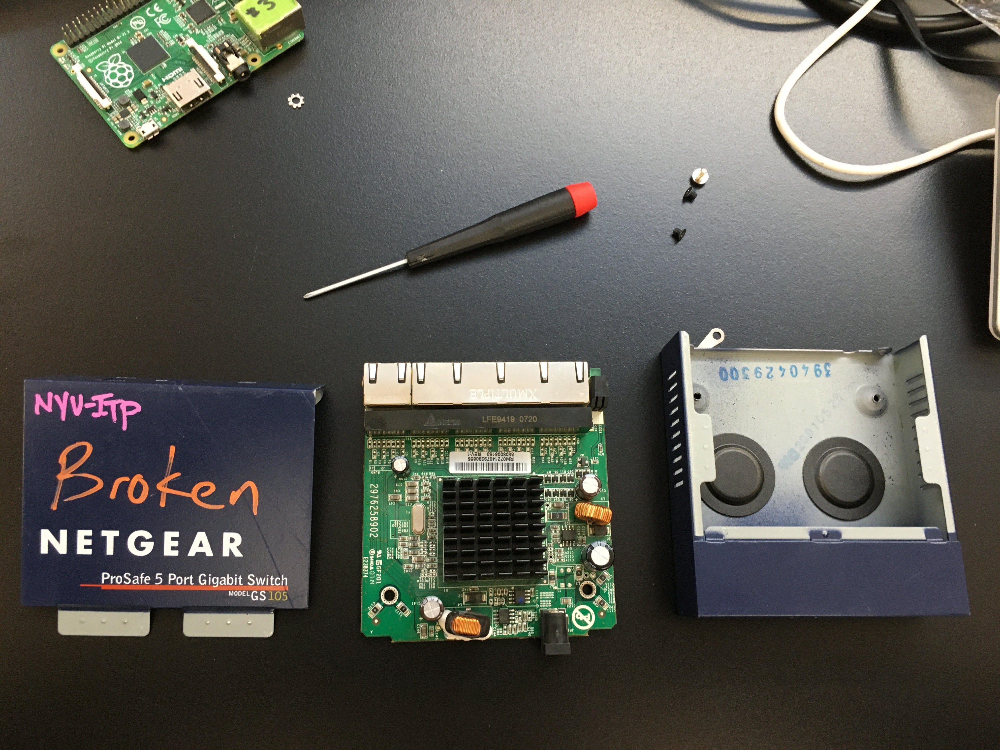
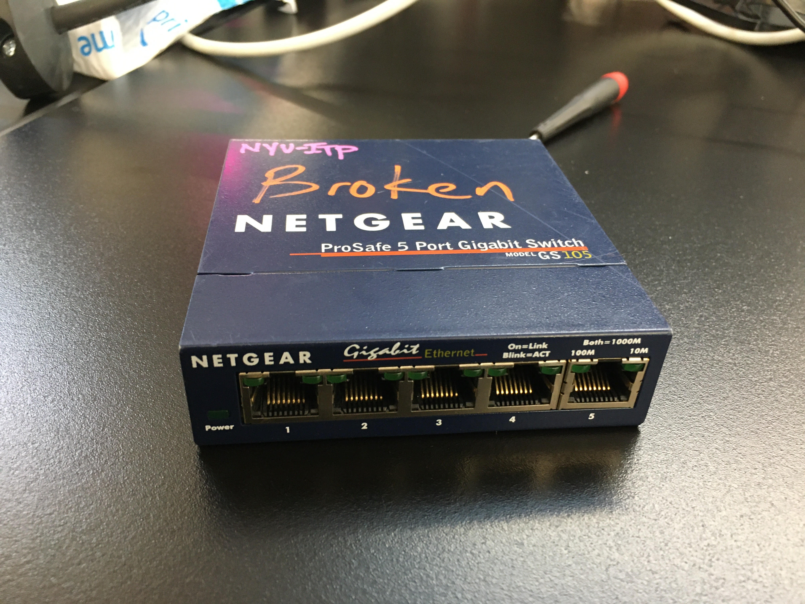
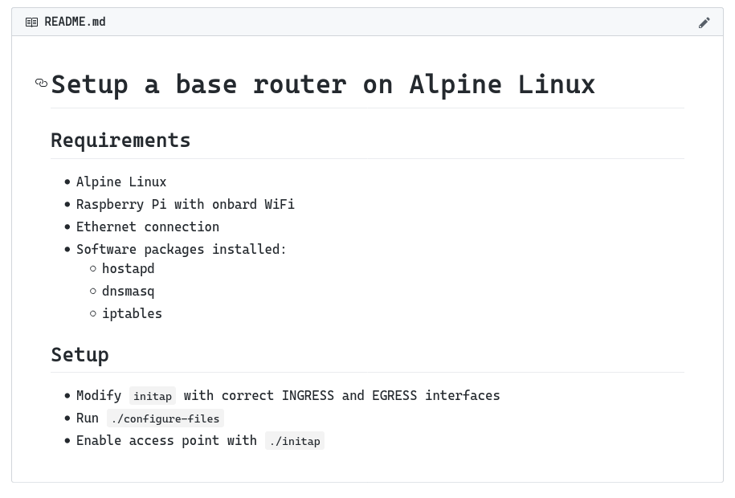
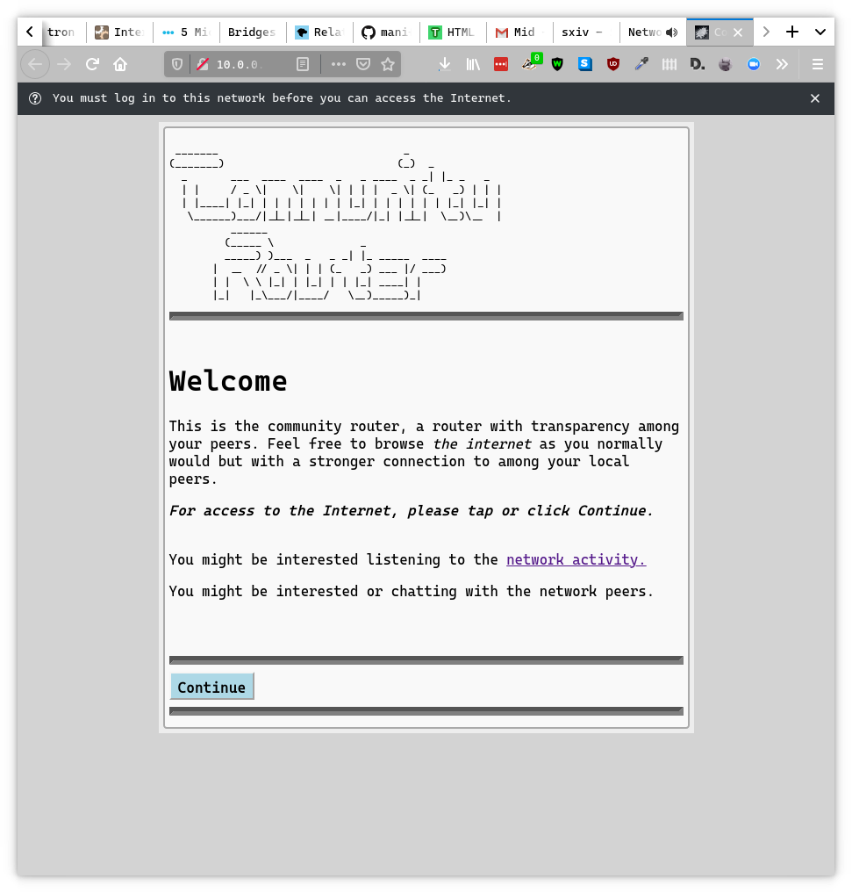
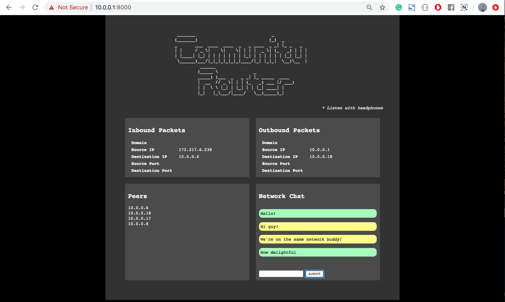

# Progress

---

## Listen to the Network

<div style="margin:auto; max-width:800px"><video width="100%" controls>
  <source src="./listennetwork3.mp4" type="video/mp4">
Your browser does not support the video tag.
</video> </div>

---

## Coffee Can WiFi
<div style="margin:auto; max-width:800px"><video width="100%" controls>
  <source src="./coffeecan_export.mp4" type="video/mp4">
Your browser does not support the video tag.
</video> </div>

Plays music scale  based on connected peers

---

## Traceroute map
<div style="margin:auto; max-width:800px"><video width="100%" controls>
  <source src="./compassvid.mp4" type="video/mp4">
Your browser does not support the video tag.
</video> </div>

Map server hops from network

---
What makes a router?

<div style="width:800px; margin:auto;">
<div class="gridImg">
<div class="gridItem"></div>
<div class="gridItem"></div>
</div>
<div class="gridImg">
<div class="gridItem"></div>
<div class="gridItem"></div>
</div>
</div>

---

<div class="left" style="width:40%"> <h1>Create open source resources</h1></div>

<div class="right" style="width:50%">

</div>

---

Raspberry Pi  
Wireless Access Point


---
```
 _______                              _
 (_______)                            (_)  _
  _       ___  ____  ____  _   _ ____  _ _| |_ _   _
  | |     / _ \|    \|    \| | | |  _ \| (_   _) | | |
  | |____| |_| | | | | | | | |_| | | | | | | |_| |_| |
   \______)___/|_|_|_|_|_|_|____/|_| |_|_|  \__)\__  |
         ______
         (_____ \              _
          _____) )___  _   _ _| |_ _____  ____
          |  __  // _ \| | | (_   _) ___ |/ ___)
          | |  \ \ |_| | |_| | | |_| ____| |
          |_|   |_\___/|____/   \__)_____)_|

  
```

--- 



---



---

Key Components:  
<div class="center">
<ul>
<li>Network Events</li>
<li>Splash page</li>
<li>Network peers</li>
<li>Deep packet inspection</li>
<ul>
  <li>Domains</li>
  <li>Ports (protocol)</li>
  <li>IP Addresses</li>
</ul>
<li>Network Events</li>
<li>Firewall</li>
<li>Web server</li>
<li>Voting system</li>
</ul>
</div>

