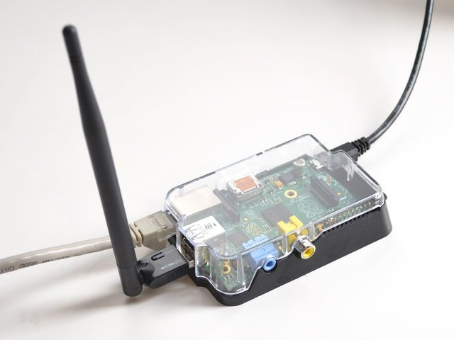

# Process

---

Raspberry Pi  
Wireless Access Point



---
```
 _______                              _
 (_______)                            (_)  _
  _       ___  ____  ____  _   _ ____  _ _| |_ _   _
  | |     / _ \|    \|    \| | | |  _ \| (_   _) | | |
  | |____| |_| | | | | | | | |_| | | | | | | |_| |_| |
   \______)___/|_|_|_|_|_|_|____/|_| |_|_|  \__)\__  |
         ______
         (_____ \              _
          _____) )___  _   _ _| |_ _____  ____
          |  __  // _ \| | | (_   _) ___ |/ ___)
          | |  \ \ |_| | |_| | | |_| ____| |
          |_|   |_\___/|____/   \__)_____)_|

  
```

--- 

<div class="left" style="width:40%"> <h1>Create open source resources</h1></div>

<div class="right" style="width:50%">

</div>
